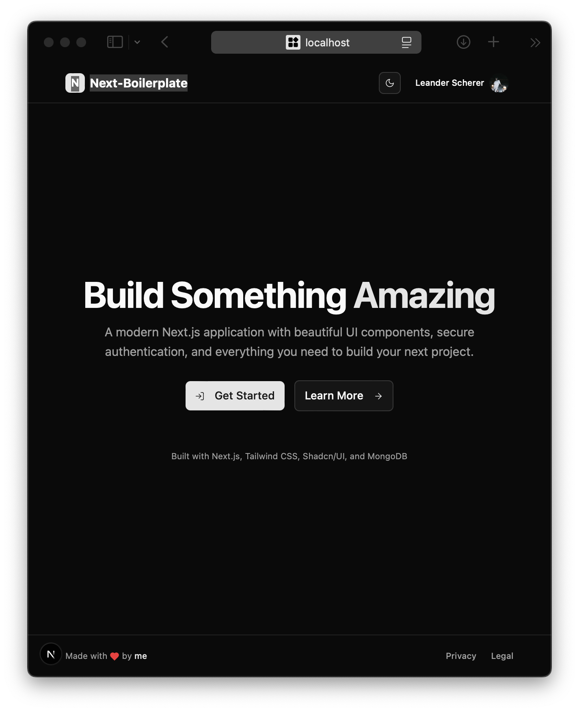
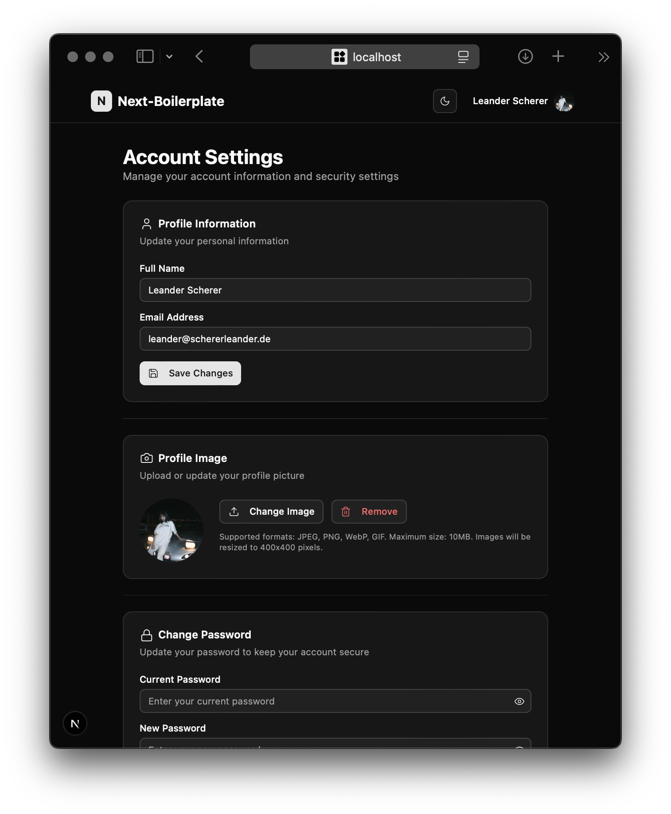

# Nextjs-Boilerplate

A Next.js application with user authentication, profile management, and file storage capabilities.

## Screenshots

<div align="center">
  
  
</div>

## Prerequisites

- Node.js 18+ 
- Docker and Docker Compose
- npm/yarn/pnpm

## Environment Variables

Create a `.env` file in the root directory with the following variables:

```env
# MongoDB
MONGO_INITDB_ROOT_USERNAME=admin
MONGO_INITDB_ROOT_PASSWORD=your-mongodb-password
MONGO_INITDB_DATABASE=your-database-name
MONGO_ENDPOINT_HOST=localhost
MONGO_ENDPOINT_PORT=27017
MONGODB_URI="mongodb://${MONGO_INITDB_ROOT_USERNAME}:${MONGO_INITDB_ROOT_PASSWORD}@${MONGO_ENDPOINT_HOST}:${MONGO_ENDPOINT_PORT}/${MONGO_INITDB_DATABASE}?authSource=admin"

# MinIO Object Storage
MINIO_ROOT_USER=admin
MINIO_ROOT_PASSWORD=your-minio-password
MINIO_ENDPOINT_HOST=localhost
MINIO_ENDPOINT_PORT=9000
MINIO_ACCESS_KEY=${MINIO_ROOT_USER}
MINIO_SECRET_KEY=${MINIO_ROOT_PASSWORD}

# NextAuth
NEXTAUTH_SECRET=your-secret-key-here
NEXTAUTH_URL=localhost:3000
```

## Quick Start

1. **Clone and install dependencies:**
   ```bash
   npm install
   ```

2. **Start the database and storage services:**
   ```bash
   docker-compose up -d
   ```

3. **Run the development server:**
   ```bash
   npm run dev
   ```

4. **Access the application:**
   - App: http://localhost:3000
   - MinIO Web Interface: http://localhost:9001

## Database Setup

### MongoDB
- **Container**: MongoDB 7.0 with authentication
- **Port**: 27017
- **Database**: `MONGO_INITDB_DATABASE`
- **Admin User**: Set via `MONGO_INITDB_ROOT_USERNAME` and `MONGO_INITDB_ROOT_PASSWORD`

The MongoDB instance will automatically create the specified database and user on first startup.

## Storage Setup

### MinIO Object Storage
- **Container**: MinIO latest with web console
- **API Port**: 9000
- **Console Port**: 9001
- **Bucket**: `storage` (auto-created)
- **Access**: Set via `MINIO_ROOT_USER` and `MINIO_ROOT_PASSWORD`

## Development

```bash
# Start services
docker-compose up -d

# Run development server
npm run dev

# Stop services
docker-compose down
```

## Production Deployment

Update the following environment variables for production:
- Set `NEXTAUTH_URL` to your domain
- Use strong passwords for database and storage
- Configure SSL for MinIO (`useSSL: true` in MinIO client)
